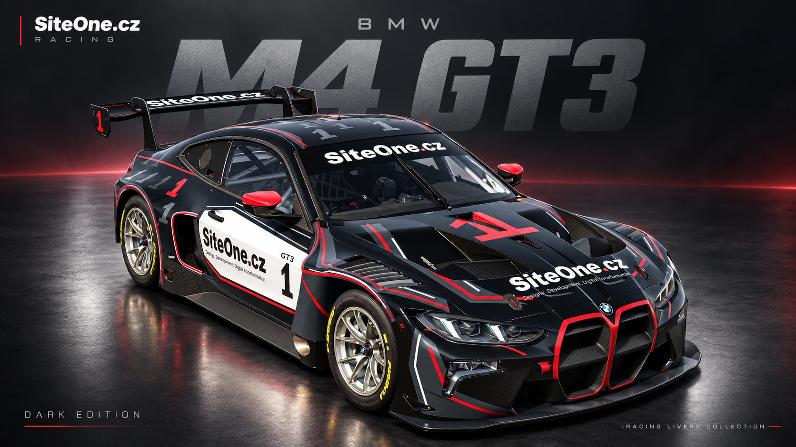
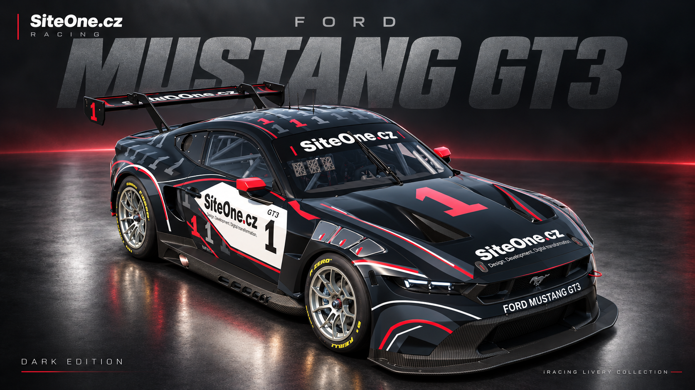
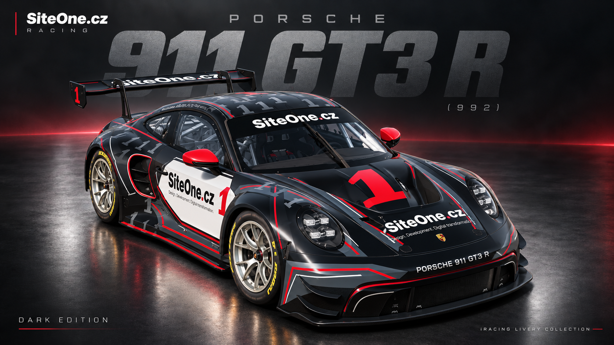
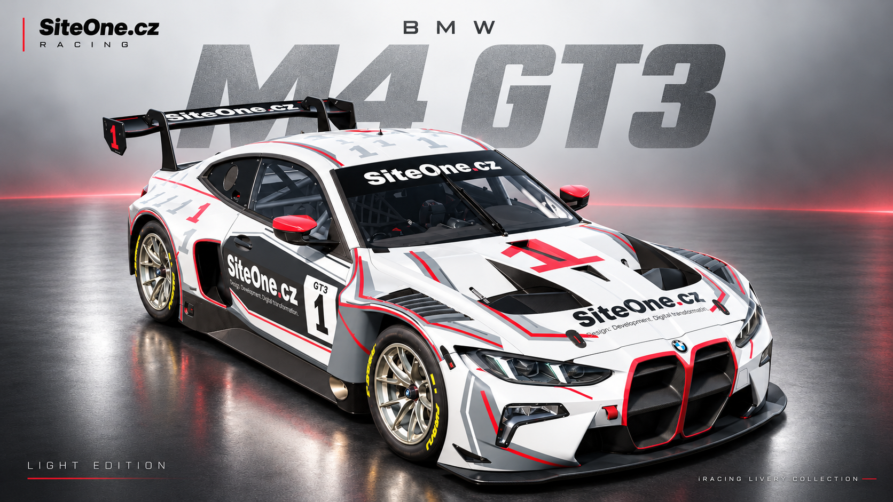
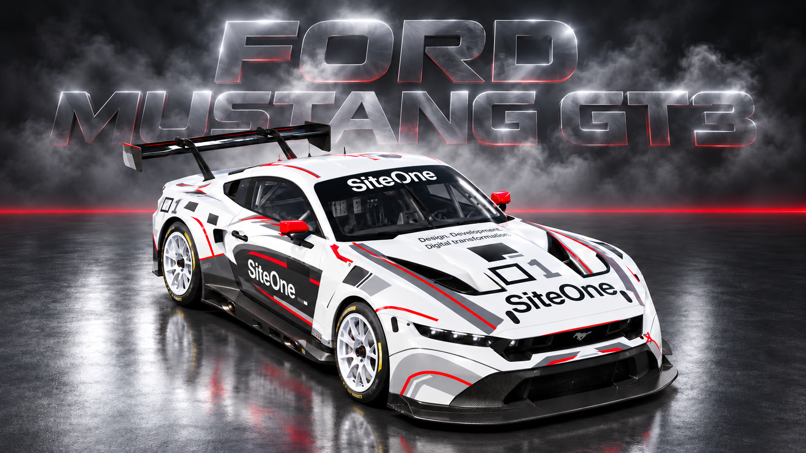
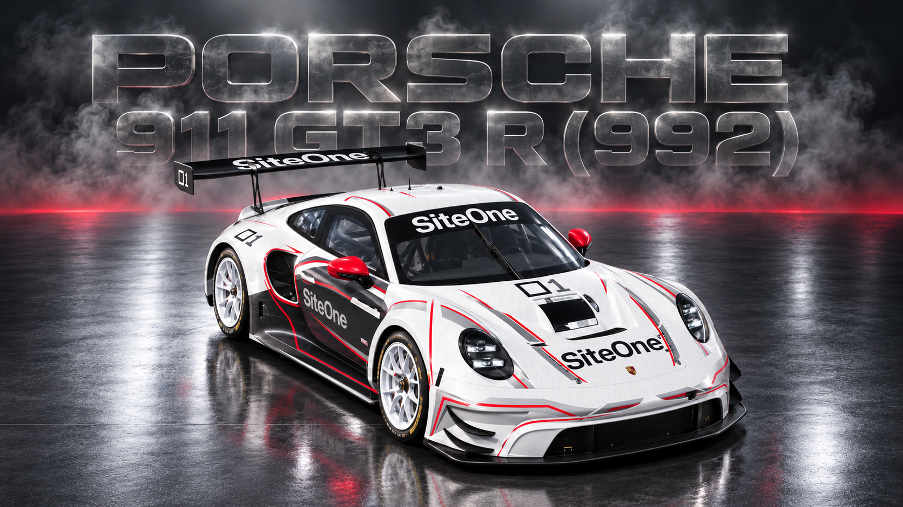

# SiteOne.cz | iRacing Liveries

Five cars, ten finishes, plus matching helmet and driver suit. One visual identity.

Dark graphite and light pearl SiteOne liveries with layered PSD sources and matching material maps.

## GT3 catalog / Katalog pro tým

**[Stáhnout český katalog PDF](https://raw.githubusercontent.com/Buchtanen/siteone-iracing-liveries/main/catalog/SiteOne_Racing_GT3_Catalog_CZ.pdf)** - 13 stran, šest studiových preview a návod k Trading Paints Free.

Katalog představuje BMW M4 GT3 EVO, Ford Mustang GT3 a Porsche 911 GT3 R (992), každý v tmavé a světlé variantě. Archiv laků níže obsahuje také McLaren a Radical.

| BMW M4 GT3 EVO | Ford Mustang GT3 | Porsche 911 GT3 R (992) |
| --- | --- | --- |
|  |  |  |
|  |  |  |

[Samostatná preview PNG](previews/) jsou studiové ilustrace překreslené podle iRacingu. Přesnou podobu ve hře určují skutečné textury TGA a materiálové mapy MIP.

## Jak jezdit týmové laky

1. Přihlaste se na Trading Paints přes iRacing a nainstalujte [Trading Paints Downloader](https://www.tradingpaints.com/page/Install).
2. Otevřete [veřejnou kolekci SiteOne Racing](https://www.tradingpaints.com/collections/view/356562/SiteOne-Racing).
3. Vyberte dostupný lak pro přesný model auta a požadovanou variantu. Pro účet Free vyberte **Sim-Stamped Number**.
4. Klikněte na **Race this paint**. Lak se objeví v **My Paints**.
5. Nechte Downloader běžet a otevřete iRacing. Podrobná nastavení, odlesky a řešení problémů najdete v katalogu.

GitHub slouží jako archiv souborů a pracovních zdrojů. Pro běžné týmové ježdění není potřeba PSD ani ruční kopírování textur.

## Downloads

### McLaren 570S GT4

- **Dark**: [paint TGA](cars/mclaren-570s-gt4/dark/paint.tga) · [spec MIP](cars/mclaren-570s-gt4/dark/spec.mip) · [layered PSD sources ZIP](cars/mclaren-570s-gt4/dark/sources-psd.zip)
- **Light**: [paint TGA](cars/mclaren-570s-gt4/light/paint.tga) · [spec MIP](cars/mclaren-570s-gt4/light/spec.mip) · [layered PSD sources ZIP](cars/mclaren-570s-gt4/light/sources-psd.zip)

### Ford Mustang GT3

- **Dark**: [paint TGA](cars/ford-mustang-gt3/dark/paint.tga) · [spec MIP](cars/ford-mustang-gt3/dark/spec.mip) · [layered PSD sources ZIP](cars/ford-mustang-gt3/dark/sources-psd.zip)
- **Light**: [paint TGA](cars/ford-mustang-gt3/light/paint.tga) · [spec MIP](cars/ford-mustang-gt3/light/spec.mip) · [layered PSD sources ZIP](cars/ford-mustang-gt3/light/sources-psd.zip)

### Radical SR10

- **Dark**: [paint TGA](cars/radical-sr10/dark/paint.tga) · [spec MIP](cars/radical-sr10/dark/spec.mip) · [layered PSD sources ZIP](cars/radical-sr10/dark/sources-psd.zip)
- **Light**: [paint TGA](cars/radical-sr10/light/paint.tga) · [spec MIP](cars/radical-sr10/light/spec.mip) · [layered PSD sources ZIP](cars/radical-sr10/light/sources-psd.zip)

### BMW M4 GT3 EVO

- **Dark**: [paint TGA](cars/bmw-m4-gt3/dark/paint.tga) · [spec MIP](cars/bmw-m4-gt3/dark/spec.mip) · [layered PSD sources ZIP](cars/bmw-m4-gt3/dark/sources-psd.zip)
- **Light**: [paint TGA](cars/bmw-m4-gt3/light/paint.tga) · [spec MIP](cars/bmw-m4-gt3/light/spec.mip) · [layered PSD sources ZIP](cars/bmw-m4-gt3/light/sources-psd.zip)

### Porsche 911 GT3 R (992)

- **Dark**: [paint TGA](cars/porsche-992-gt3-r/dark/paint.tga) · [spec MIP](cars/porsche-992-gt3-r/dark/spec.mip) · [layered PSD sources ZIP](cars/porsche-992-gt3-r/dark/sources-psd.zip)
- **Light**: [paint TGA](cars/porsche-992-gt3-r/light/paint.tga) · [spec MIP](cars/porsche-992-gt3-r/light/spec.mip) · [layered PSD sources ZIP](cars/porsche-992-gt3-r/light/sources-psd.zip)

## Driver gear

The current SiteOne.cz / Buchtanen helmet and driver suit use the original iRacing UV templates at 1024 × 1024. Each folder includes the 24-bit RLE TGA, layered working PSD in a source ZIP, approved design image, Wire map, and a seam check.

- **Helmet v5**: [TGA](gear/helmet/paint.tga) · [layered PSD and source files](gear/helmet/sources-psd.zip) · [Wire and seam notes](gear/helmet/README.md)
- **Driver suit v3**: [TGA](gear/driver-suit/paint.tga) · [layered PSD and source files](gear/driver-suit/sources-psd.zip) · [Wire and seam notes](gear/driver-suit/README.md)

The helmet and driver suit source ZIPs use LZMA compression; open them with 7-Zip or another ZIP/LZMA extractor.

## Car paints: Trading Paints Free and Pro

For the free account workflow, select an available Sim-Stamped Number paint in the public collection and click Race this paint. Alternatively, paint.tga can be uploaded under My Paints. iRacing adds the session number; it may cover graphics or appear alongside the decorative 1. Assigning Custom Number paints through Trading Paints requires Pro. The studio illustrations show the team design and do not guarantee the same session number placement. PSD files allow the number area to be adapted if required.

Add the matching spec.mip as the spec map. All branding is included in the paint TGA; no separate Pro decal layer is necessary.

Official guidance: [Custom Number paints](https://help.tradingpaints.com/painting/what-is-a-custom-number-paint-and-how-do-they-work/) · [Downloader](https://www.tradingpaints.com/page/Install).

## Source files

For cars, each sources-psd.zip contains the layered paint PSD, material PSD and source spec TGA. The newer cars also include editable SVG curves. UV maps and seam notes are stored beside each car's variants. Gear source ZIPs contain their layered PSD, approved artwork and Wire/seam references.

Car paints use 2048 × 2048 RGB 24-bit RLE TGA. Helmet and suit use the native 1024 × 1024 RGB 24-bit RLE TGA. Material MIPs for cars were generated in iRacing. Wheel colors are configured separately in iRacing.

This repository publishes the finished collection only. Original manufacturer template archives and historical drafts are not included. Vehicle and game marks identify the supported models.
